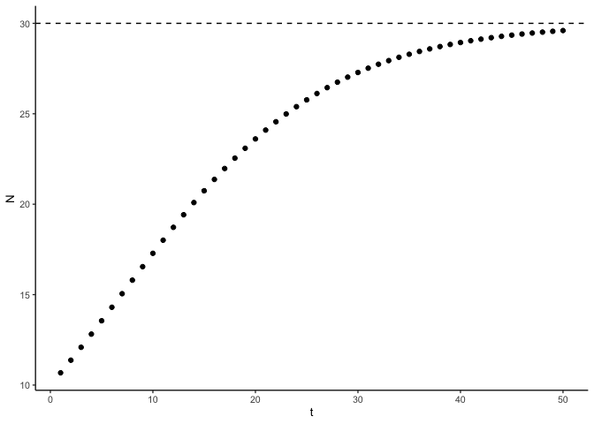
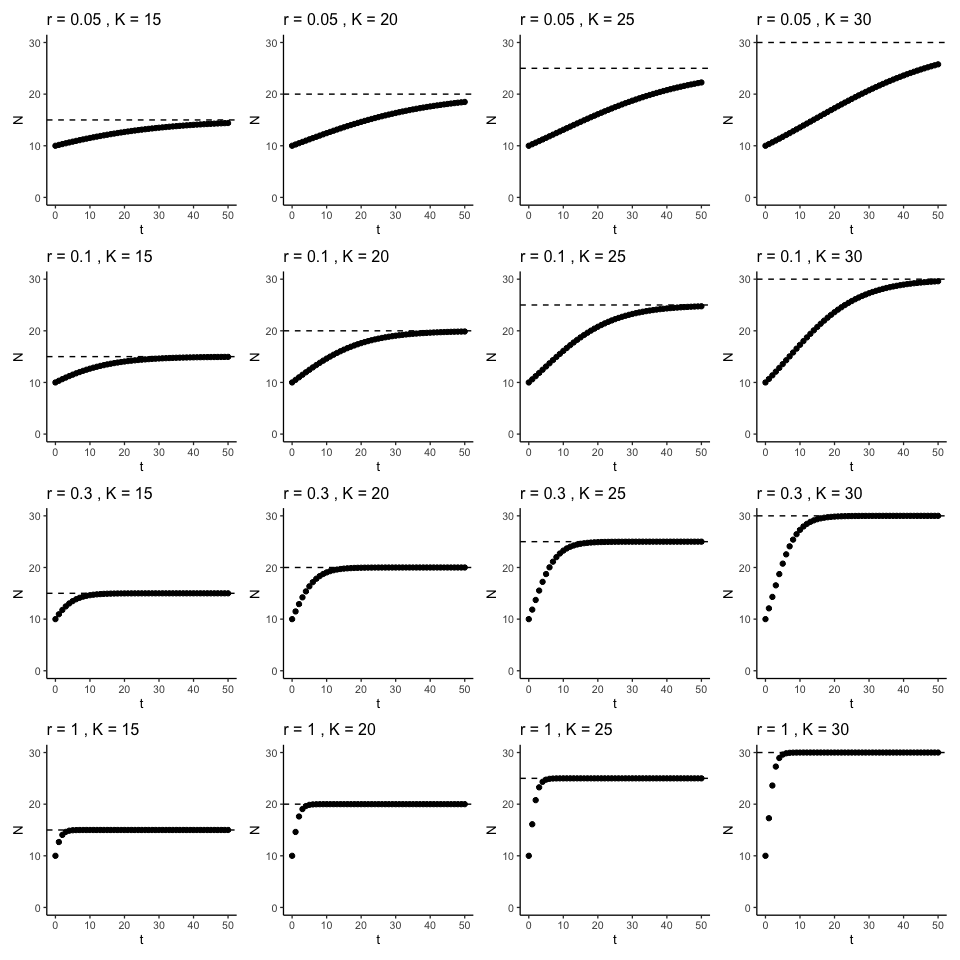

# Euler’s method
eleanorjackson
2024-09-02

Differential equations describe how one term changes with respect to
another term. One ecology example is how a population changes over time.

$$
\frac{dN}{dt} = rN
$$

Where $dN$ is a small change in population size $N$ with a small change
in time $t$. $r$ is the growth rate (births - deaths).

We can extend this model to include carrying capacity (now a logistic
model).

$$
\frac{dN}{dt} = rN (1- \frac{N}{K})
$$

Euler’s method is a technique to solve differential equations. Using
that method, we can solve the equation to get this:

$$
N_{t+dt} = N_{t} + [rN_{t} (1-\frac{N_{t}}{K}) ]dt
$$

We are going to try and simulate the logistic model using Euler’s
method.

``` r
library("tidyverse")
library("here")
library("patchwork")
```

``` r
get_N <- function(K, N0, r, t) {
  (K * N0) / (N0 + (K - N0) * exp(- r * t))
}
```

Let’s say we know that at the initial time point $N$ is 10, and that $r$
is 0.1 and $K$ is 30.

``` r
tibble(
    t = seq(1, 50, 1)
  ) %>% 
  mutate(
    N = get_N(K = 30, N0 = 10, r = 0.1, t = t)
    ) %>% 
  ggplot(aes(x = t, y = N)) +
  geom_point() +
  geom_hline(yintercept = 30, linetype = 2)
```



Try some other values of $r$ and $K$.

``` r
rK_vals <- 
  tibble(
  r = c(1, 0.3, 0.1, 0.05),
  K = seq(15, 30, 5)
) %>% 
  expand(r, K)
```

``` r
plot_mod <- function(r, K, N0, t) {
  tibble(t = t) %>% 
  mutate(
    N = get_N(K, N0, r, t)
    ) %>% 
  ggplot(aes(x = t, y = N)) +
  geom_point() +
  geom_hline(yintercept = K, linetype = 2) +
  ylim(0,30) +
  ggtitle(paste("r =", r, ", K =", K))
}
```

``` r
map2(
  .x = rK_vals$r,
  .y = rK_vals$K,
  .f = plot_mod,
  N0 = 10,
  t = seq(0, 50, 1)
) %>% 
  patchwork::wrap_plots()
```


