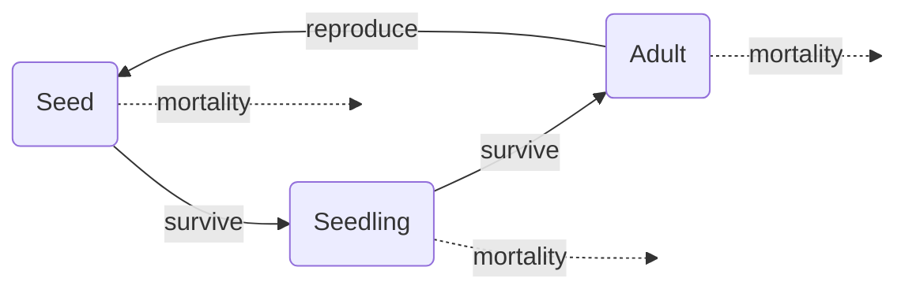

# Constructing a simple model
eleanorjackson
2024-10-11

``` r
library("tidyverse")
library("patchwork")
```

### Flow diagram of the model



### Specifying the model

$$
n_s(t) = n_a(t) - M_s(t)
$$

$$
n_j(t) = n_a(t) - M_j(t)
$$

$$
n_a(t) = n_s(t) - M_a(t)
$$

Number of seeds at time $t$ equals the number of adults minus the
mortality of seeds.

Number of juveniles at time $t$ equals the number of seeds minus the
mortality of juveniles.

Number of adults at time $t$ equals the number of juveniles minus the
mortality of adults.

I think we want a discrete time model rather than continuous time -
continuous time might allow continuous production of seeds, while this
only happens annually. So a sensible time step might be 1 year?

A *recursion equation* describes the value of a variable in the next
time step. e.g.

$$
n(t + 1) = n(t) + \text{increase} - \text{decrease}
$$

In continuous time models you use *differential equations,* which
specify the rate of change of the variables over time. e.g.

$$
\frac{\text{d}(n(t))}{\text{d}t} = \text{rate of increase} - \text{rate of decrease}
$$

You can also have something called a *difference equation,* which might
describe the change in a variable within a time step. e.g.

$$
\Delta n = \text{increase} - \text{decrease}
$$

Constraints of this model might be that,

- the number of seeds and is always larger than the number of juveniles
  and the number of juveniles is always larger than the number of adults
- none of the parameters can be less than one

https://kevintshoemaker.github.io/NRES-470/LECTURE7.html

https://kevintshoemaker.github.io/NRES-470/LAB4.html

http://ecovirtual.ib.usp.br/doku.php?id=en:ecovirt:roteiro:pop_str:pstr_mtr

## Transition matrix

A Leslie matrix has one column for each age class. A Lefkovitch matrix
allows individuals to remain in life-stages for more than one time
step - useful for plant and animals with stage-dependent demography.

``` r
t_mat <- matrix(     
  c(
    0.25, 1.5, 1.5,
    0.4, 0, 0,
    0, 0.75, 0
  ),
  nrow = 3, ncol = 3, byrow = T,
  dimnames = (list(c("seed", "juvenile", "adult"),
                  NULL))
)

t_mat
```

             [,1] [,2] [,3]
    seed     0.25 1.50  1.5
    juvenile 0.40 0.00  0.0
    adult    0.00 0.75  0.0

Starting with 1,000 seeds

``` r
abund_init <- c(1000, 0, 0)

abund_init
```

    [1] 1000    0    0

``` r
yr_1 <- t_mat %*% abund_init 

yr_1
```

             [,1]
    seed      250
    juvenile  400
    adult       0

``` r
n_years <- 30

all_years <- matrix(0, 
                    nrow = nrow(t_mat), 
                    ncol = n_years + 1)

all_years[,1] <- yr_1

for(t in 2:(n_years + 1)){   
  all_years[,t] <-  t_mat %*% all_years[,t-1]
}

all_years
```

         [,1]  [,2]    [,3]     [,4]     [,5]     [,6]      [,7]      [,8]
    [1,]  250 662.5 765.625 701.4062 932.8516 998.5879 1124.9907 1300.1836
    [2,]  400 100.0 265.000 306.2500 280.5625 373.1406  399.4352  449.9963
    [3,]    0 300.0  75.000 198.7500 229.6875 210.4219  279.8555  299.5764
              [,9]     [,10]     [,11]     [,12]     [,13]     [,14]     [,15]
    [1,] 1449.4049 1648.7072 1866.9024 2108.1821 2389.1052 2702.2916 3057.7180
    [2,]  520.0734  579.7620  659.4829  746.7609  843.2728  955.6421 1080.9167
    [3,]  337.4972  390.0551  434.8215  494.6122  560.0707  632.4546  716.7316
             [,16]     [,17]    [,18]    [,19]    [,20]    [,21]    [,22]    [,23]
    [1,] 3460.9018 3915.8875 4431.486 5014.810 5674.743 6421.740 7266.946 8223.415
    [2,] 1223.0872 1384.3607 1566.355 1772.594 2005.924 2269.897 2568.696 2906.778
    [3,]  810.6875  917.3154 1038.271 1174.766 1329.446 1504.443 1702.423 1926.522
            [,24]     [,25]     [,26]     [,27]     [,28]     [,29]     [,30]
    [1,] 9305.804 10530.626 11916.676 13485.156 15260.076 17268.617 19541.520
    [2,] 3289.366  3722.322  4212.250  4766.670  5394.063  6104.031  6907.447
    [3,] 2180.084  2467.025  2791.741  3159.188  3575.003  4045.547  4578.023
             [,31]
    [1,] 22113.585
    [2,]  7816.608
    [3,]  5180.585

``` r
all_years %>% 
  as_tibble(name_repair = "unique") %>% 
  rowid_to_column(var = "stage") %>% 
  pivot_longer(cols = contains("V"),
               names_to = "time") %>% 
  mutate(stage = recode(stage, 
                        "seeds",
                        "juveniles",
                        "adults"),
         time = as.numeric(str_remove(time, pattern = "V"))) %>% 
  ggplot(aes(x = time, y = value, 
             colour = stage, group = stage)) +
  geom_line()
```


The model should have a stable age structure where the proportion of
individuals in each age group remains constant.

``` r
all_years %>% 
  as_tibble(name_repair = "unique") %>% 
  rowid_to_column(var = "stage") %>% 
  pivot_longer(cols = contains("V"),
               names_to = "time") %>% 
  mutate(stage = recode(stage, 
                        "seeds",
                        "juveniles",
                        "adults"),
         time = as.numeric(str_remove(time, pattern = "V"))) %>% 
  ggplot(aes(x = time, y = value, fill = stage)) +
  geom_col() +
  
  all_years %>% 
  as_tibble(name_repair = "unique") %>% 
  rowid_to_column(var = "stage") %>% 
  pivot_longer(cols = contains("V"),
               names_to = "time") %>% 
  mutate(stage = recode(stage, 
                        "seeds",
                        "juveniles",
                        "adults"),
         time = as.numeric(str_remove(time, pattern = "V"))) %>% 
  ggplot(aes(x = time, y = value, fill = stage)) +
  geom_col(position = "fill") +
  
  plot_layout(guides = "collect", ncol = 1)
```


