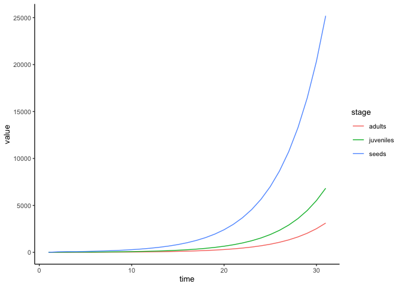
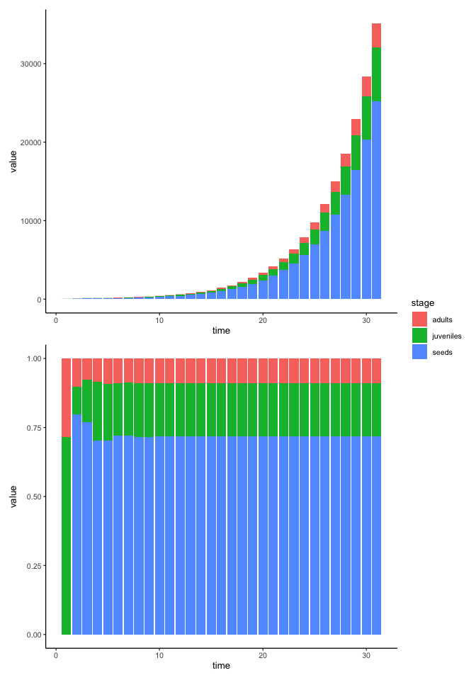

# Constructing a simple model
eleanorjackson
2024-10-11

``` r
library("tidyverse")
library("patchwork")
```

### Flow diagram of the model


### Specifying the model

$$
n_s(t) = n_a(t) - M_s(t)
$$

$$
n_j(t) = n_a(t) - M_j(t)
$$

$$
n_a(t) = n_s(t) - M_a(t)
$$

Number of seeds at time $t$ equals the number of adults minus the
mortality of seeds.

Number of juveniles at time $t$ equals the number of seeds minus the
mortality of juveniles.

Number of adults at time $t$ equals the number of juveniles minus the
mortality of adults.

I think we want a discrete time model rather than continuous time -
continuous time might allow continuous production of seeds, while this
only happens annually. So a sensible time step might be 1 year?

A *recursion equation* describes the value of a variable in the next
time step. e.g.

$$
n(t + 1) = n(t) + \text{increase} - \text{decrease}
$$

In continuous time models you use *differential equations,* which
specify the rate of change of the variables over time. e.g.

$$
\frac{\text{d}(n(t))}{\text{d}t} = \text{rate of increase} - \text{rate of decrease}
$$

You can also have something called a *difference equation,* which might
describe the change in a variable within a time step. e.g.

$$
\Delta n = \text{increase} - \text{decrease}
$$

Constraints of this model might be that,

- the number of seeds and is always larger than the number of juveniles
  and the number of juveniles is always larger than the number of adults
- none of the parameters can be less than one

https://kevintshoemaker.github.io/NRES-470/LECTURE7.html

https://kevintshoemaker.github.io/NRES-470/LAB4.html

http://ecovirtual.ib.usp.br/doku.php?id=en:ecovirt:roteiro:pop_str:pstr_mtr

## Transition matrix

A Leslie matrix has one column for each age class. A Lefkovitch matrix
allows individuals to remain in life-stages for more than one time
step - useful for plant and animals with stage-dependent demography.

``` r
t_mat <- matrix(     
  c(
    0, 0, 10,
    0.2, 0.5, 0,
    0, 0.2, 0.8
  ),
  nrow = 3, ncol = 3, byrow = T,
  dimnames = (list(c("seed", "juvenile", "adult"),
                  NULL))
)

t_mat
```

             [,1] [,2] [,3]
    seed      0.0  0.0 10.0
    juvenile  0.2  0.5  0.0
    adult     0.0  0.2  0.8

|  | seed | juvenile | adult |
|:---|:---|:---|:---|
| **seed** | seed remaining seed | from juvenile to seed | from adult to seed |
| **juvenile** | from seed to juvenile | juvenile remaining juvenile | from adult to juvenile |
| **adult** | from seed to adult | from juvenile to adult | adult remaining adult |

Starting with 30 juvenile plants

``` r
abund_init <- c(0, 30, 0)

abund_init
```

    [1]  0 30  0

``` r
yr_1 <- t_mat %*% abund_init 

yr_1
```

             [,1]
    seed        0
    juvenile   15
    adult       6

``` r
n_years <- 30

all_years <- matrix(0, 
                    nrow = nrow(t_mat), 
                    ncol = n_years + 1)

all_years[,1] <- yr_1

for(t in 2:(n_years + 1)){   
  all_years[,t] <-  t_mat %*% all_years[,t-1]
}

all_years
```

         [,1] [,2]  [,3]   [,4]    [,5]      [,6]      [,7]      [,8]      [,9]
    [1,]    0 60.0 78.00 77.400 93.4200 121.68600 151.78380 186.01254 229.77718
    [2,]   15  7.5 15.75 23.475 27.2175  32.29275  40.48358  50.59855  62.50178
    [3,]    6  7.8  7.74  9.342 12.1686  15.17838  18.60125  22.97772  28.50188
             [,10]     [,11]     [,12]     [,13]     [,14]    [,15]     [,16]
    [1,] 285.01884 353.01864 436.82756 540.67591 669.35512 828.6223 1025.7373
    [2,]  77.20633  95.60693 118.40719 146.56911 181.41974 224.5809  278.0149
    [3,]  35.30186  43.68276  54.06759  66.93551  82.86223 102.5737  126.9752
             [,17]     [,18]     [,19]     [,20]     [,21]     [,22]     [,23]
    [1,] 1269.7516 1571.8311 1945.7747 2408.6754 2981.7005 3691.0505 4569.1555
    [2,]  344.1549  426.0278  527.3801  652.8450  808.1576 1000.4189 1238.4195
    [3,]  157.1831  194.5775  240.8675  298.1701  369.1050  456.9156  565.6162
             [,24]     [,25]    [,26]     [,27]     [,28]     [,29]     [,30]
    [1,] 5656.1622 7001.7688 8667.497 10729.503 13282.063 16441.879 20353.419
    [2,] 1533.0409 1897.7529 2349.230  2908.114  3599.958  4456.392  5516.572
    [3,]  700.1769  866.7497 1072.950  1328.206  1644.188  2035.342  2519.552
             [,31]
    [1,] 25195.518
    [2,]  6828.970
    [3,]  3118.956

``` r
all_years %>% 
  as_tibble(name_repair = "unique") %>% 
  rowid_to_column(var = "stage") %>% 
  pivot_longer(cols = contains("V"),
               names_to = "time") %>% 
  mutate(stage = recode(stage, 
                        "seeds",
                        "juveniles",
                        "adults"),
         time = as.numeric(str_remove(time, pattern = "V"))) %>% 
  ggplot(aes(x = time, y = value, 
             colour = stage, group = stage)) +
  geom_line()
```



The model should have a stable age structure where the proportion of
individuals in each age group remains constant.

``` r
all_years %>% 
  as_tibble(name_repair = "unique") %>% 
  rowid_to_column(var = "stage") %>% 
  pivot_longer(cols = contains("V"),
               names_to = "time") %>% 
  mutate(stage = recode(stage, 
                        "seeds",
                        "juveniles",
                        "adults"),
         time = as.numeric(str_remove(time, pattern = "V"))) %>% 
  ggplot(aes(x = time, y = value, fill = stage)) +
  geom_col() +
  
  all_years %>% 
  as_tibble(name_repair = "unique") %>% 
  rowid_to_column(var = "stage") %>% 
  pivot_longer(cols = contains("V"),
               names_to = "time") %>% 
  mutate(stage = recode(stage, 
                        "seeds",
                        "juveniles",
                        "adults"),
         time = as.numeric(str_remove(time, pattern = "V"))) %>% 
  ggplot(aes(x = time, y = value, fill = stage)) +
  geom_col(position = "fill") +
  
  plot_layout(guides = "collect", ncol = 1)
```


