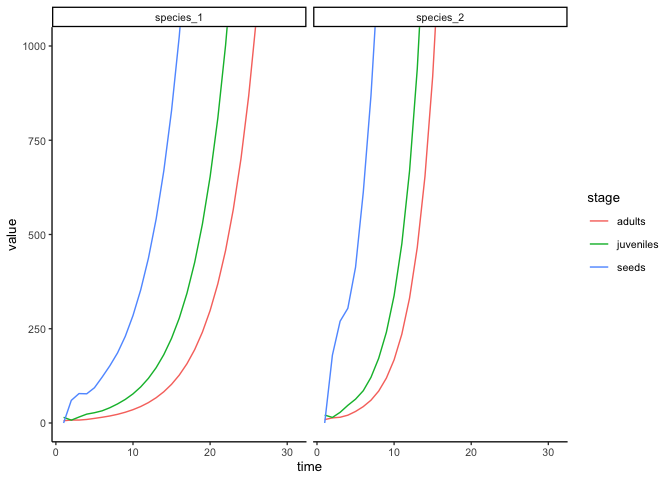
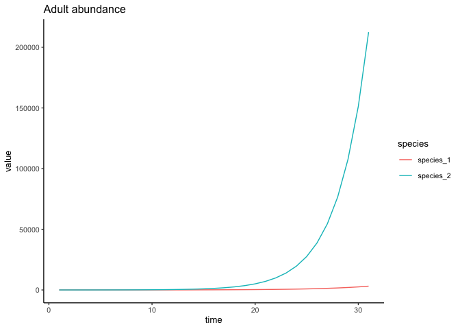

# Matrix community models
eleanorjackson
2024-10-24

``` r
library("tidyverse")
library("patchwork")
```

> Matrix community models are sets of single-species matrix population
> models that are linked together to capture community-wide dynamics.
> [Lytle & Tonkin, 2023](https://doi.org/10.1038/s44185-023-00031-5)

You can link the species matrices by including a density assumption -
density dependence is a result of abundances of other species.

For now just try running 2 species with different transition matrices.

``` r
t_mat_sp1 <- matrix(     
  c(
    0, 0, 10,
    0.2, 0.5, 0,
    0, 0.2, 0.8
  ),
  nrow = 3, ncol = 3, byrow = T,
  dimnames = (list(c("seed", "juvenile", "adult"),
                  NULL))
)

t_mat_sp2 <- matrix(     
  c(
    0, 0, 20,
    0.1, 0.7, 0,
    0, 0.3, 0.8
  ),
  nrow = 3, ncol = 3, byrow = T,
  dimnames = (list(c("seed", "juvenile", "adult"),
                  NULL))
)
```

Starting with 30 juvenile plants of each species

``` r
abund_init <- c(0, 30, 0)
```

``` r
n_years <- 30

all_years_sp1 <- matrix(0, 
                    nrow = nrow(t_mat_sp1), 
                    ncol = n_years + 1)

all_years_sp1[,1] <- t_mat_sp1 %*% abund_init 

for(t in 2:(n_years + 1)){   
  all_years_sp1[,t] <-  t_mat_sp1 %*% all_years_sp1[,t-1]
}
```

``` r
all_years_sp2 <- matrix(0, 
                    nrow = nrow(t_mat_sp2), 
                    ncol = n_years + 1)

all_years_sp2[,1] <- t_mat_sp2 %*% abund_init 

for(t in 2:(n_years + 1)){   
  all_years_sp2[,t] <-  t_mat_sp2 %*% all_years_sp2[,t-1]
}
```

``` r
sp1_tidy <- 
  all_years_sp1 %>% 
  as_tibble(name_repair = "unique") %>% 
  rowid_to_column(var = "stage") %>% 
  pivot_longer(cols = contains("V"),
               names_to = "time") %>% 
  mutate(stage = recode(stage, 
                        "seeds",
                        "juveniles",
                        "adults"),
         time = as.numeric(str_remove(time, pattern = "V")),
         species = "species_1") 

sp2_tidy <- 
  all_years_sp2 %>% 
  as_tibble(name_repair = "unique") %>% 
  rowid_to_column(var = "stage") %>% 
  pivot_longer(cols = contains("V"),
               names_to = "time") %>% 
  mutate(stage = recode(stage, 
                        "seeds",
                        "juveniles",
                        "adults"),
         time = as.numeric(str_remove(time, pattern = "V")),
         species = "species_2") 
```

``` r
bind_rows(sp1_tidy, sp2_tidy) %>% 
  ggplot(aes(x = time, y = value, 
             colour = stage, group = stage)) +
  geom_line() +
  facet_wrap(~species) +
  coord_cartesian(ylim = c(0, 1000))
```



``` r
bind_rows(sp1_tidy, sp2_tidy) %>% 
  filter(stage == "adults") %>% 
  ggplot(aes(x = time, y = value, 
             colour = species, group = species)) +
  geom_line() +
  ggtitle("Adult abundance")
```



There is [a dataset](https://doi.org/10.1002/ecy.4140) of
seedling/sapling data from the BCI 50ha plot
